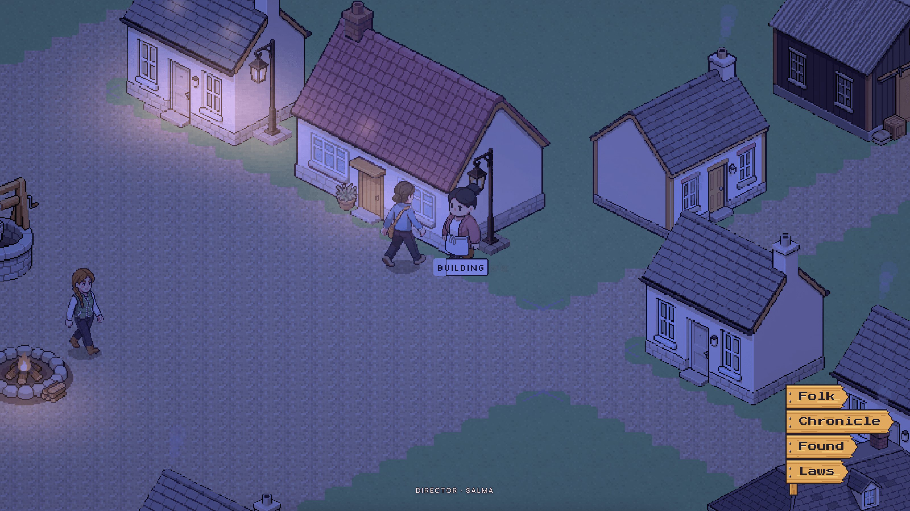
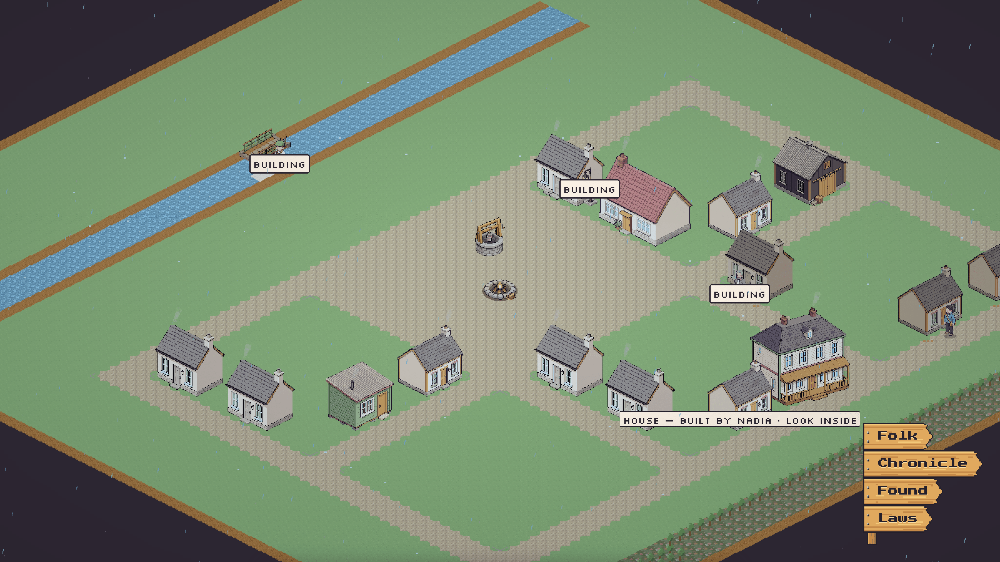
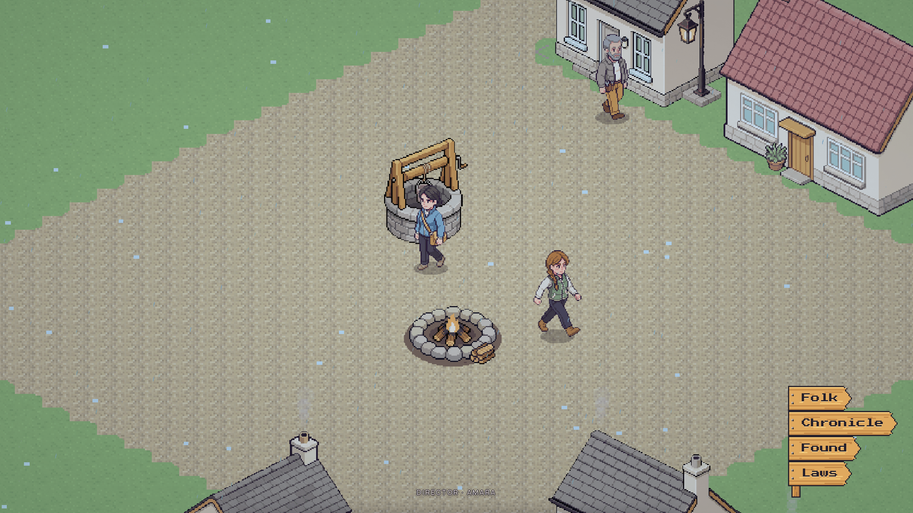
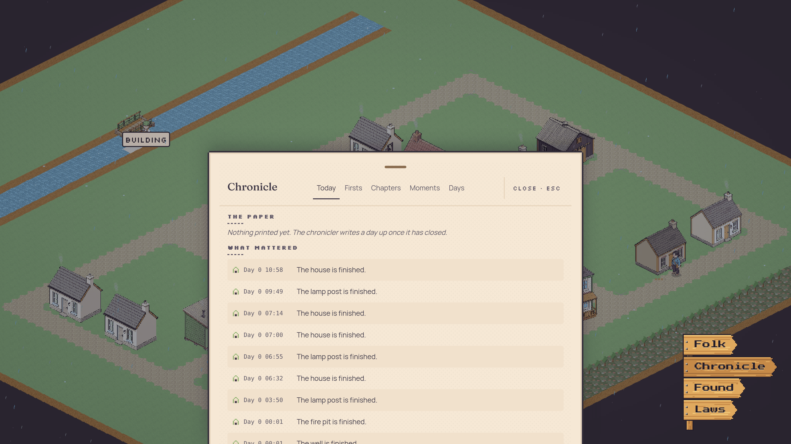
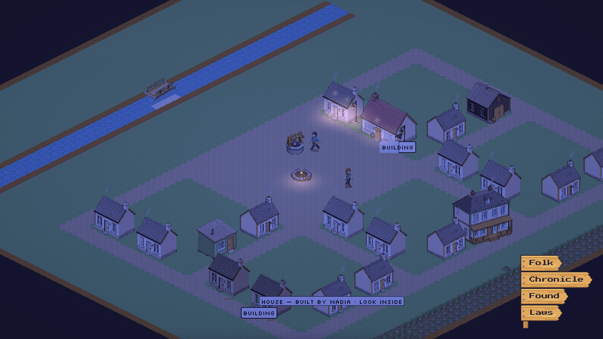

<p align="center">
  
</p>

<h1 align="center">San Junipero</h1>

<p align="center"><em>LLM simulated life.</em></p>

<p align="center">
  <a href="https://sanjunipero.deadpackets.pw"></a>
  
  
  
</p>

A small town is simulated one 2-second tick at a time, every fact of it an event in a log
that replays byte-for-byte. Five authored founders walk it as scripted bodies — free, no
key, no network — and become live LLM minds when you ask (`SJ_LIVE=1`). The design law is
**physics, never outcomes**: the engine defines what wood, rain, hunger and walls *do*, and
never what anybody should do about them. The minds noticed the cold and started building
houses anyway. Watch it run at
**[sanjunipero.deadpackets.pw](https://sanjunipero.deadpackets.pw)**.

## The town

| | |
|---|---|
|  |  |
| The plat at mid zoom — blocks, plots and roads grown from one grammar. Hover a house and it says who built it. | The square at midday — founders crossing between the well and the fire pit, act chips over the working ones. |
|  |  |
| The Signpost — the town's own paper: Folk, Chronicle, Found, Laws. | Night. The lamplighter's lamps and the fire pit hold what light there is. |

## How it works

**The loop.** Each mind's turn is perceive → think → act. The engine composes a
`PerceptionPacket` — what stands in view, who is in earshot, what the body carries, what it
knows of places it has been told about — and `@sj/agents` renders it to prose, assembles a
prompt with the mind's own memories and half-run plan, and asks the model for exactly one
verb from the engine's registry (`walk`, `chop`, `build`, `give`, `inscribe`, …). An act the
world refuses comes back as *"you cannot"* prose, not an error. Between turns the same
machinery runs `reflection`, `dream` and `recall` callers against each mind's private
SQLite memory, one file per mind.

**The fleet.** Two models, split by what they must do
([`packages/llm/src/pins.ts`](packages/llm/src/pins.ts)): `z-ai/glm-5.3-flash` for every
caller that must *name what it acts on* — turns, reflections, dreams, the arbiter — and
`deepseek/deepseek-v4-flash-0731` for the prose callers, because it wrote the best prose of
the candidates and a text-only caller cannot emit a blank act. A preflight gate asks each
provider the real schema with the real prompt before a town goes live; the bar is an
action on every call.

**The money.** Every call is booked to a ledger (`_ops.db`) at the rate the account is
actually charged — reconciled against the provider's bill, not read off a price list — and
the ledger resumes with the town, so a restart never resets a budget. Across the launch
rehearsals the live cast measured **$0.12–$0.66 per sim-day** for all five minds, the
spread being how talkative the day got. A sim-day is 1440 ticks and passes every
48 real minutes. The scripted default costs $0.00, ever.

**The record.** The world is an event log folded into state. Two viewers folding the same
events reach the same bytes — a test holds that over three sim-days
([`g6.test.ts`](packages/town/src/g6.test.ts)) — and `GET /admin/export` produces one tar
(world, minds, ledger, rulebook, chronicle, manifest with the git sha) from which anyone
can resume the town at the same tick.

**The god layer.** An arbiter adjudicates what the physics alone cannot, writes canon, and
keeps a codex of rulings; a ruling can mint a new verb, and reverting it unregisters the
verb again. A chronicler writes the town's chapters under vocabulary rules that are all
rules against inventing — *"hurt is never a number… never call anybody a healer unless the
town calls them one first"*
([`chronicle.ts`](packages/narrator/src/chronicle.ts)).

**The one-way glass.** No operator word reaches a mind: a scan refuses vocabulary like
`construct` or `milestone` in any mind-facing string
([`glassScan.ts`](packages/shared/src/glassScan.ts)), and the observatory opens the world
database readonly, so nothing an operator does is ever folded back into the town.

## The town's own history

All of this happened in live rehearsal runs, unauthored. The quotes are verbatim from the
minds' own journals and speech logs.

**The first house a mind ever built.** Nobody told Yusuf to build — building is a verb, not
a goal. On day 1 of a live run he set out at dawn in the rain with nine wood and two planks
on his back, journaling as he went: *"A house wants ten wood; I carry nine. Will find one
more somewhere near."* Then, at midday, one wood short and still raining: *"Cut it, walk
back to the plot at (65, 39), raise the walls. Rain be damned."* He raised the first walls a mind ever
put up while Nadia heckled him about his axe rusting and brought him two loaves he did not
ask for.

**The cold experiment.** For one three-arm live measurement the minds were allowed to feel
the night cold in their prompts — as a body reading, never a suggestion; a test holds that
no mind-facing string names a remedy. In the arm where shelter was honestly perceivable,
ten houses were started in three nights, unprompted, on reasoning like: *"Cold's biting and
I've got the wood right in my arms — a house's worth. No sense freezing while I can raise
walls."* In the arm where the cold was felt but the valley's doors didn't work, production
went to zero — a want with no road is worse than no want. The engine, not the prompt, is
where a want is made.

**Rain's rain.** Small talk is nobody's feature. Two founders, one downpour, verbatim:
*Salma: "Downpour. Nice day for it." … Omar: "You'll soak through, standing about in it."
Salma: "Rain doesn't bother me, Omar. Coughing's your own business to mind."* — And one
from the tuning era, preserved as a comment in
[`config.ts`](packages/shared/src/config.ts): lightning fires were first tried at a chance
of 0.02, and three storm days burned 27 of 42 houses. The chance is 0.001 now.

## Quickstart

```
pnpm install
pnpm stream        # build the viewer, tick the town, serve both on http://localhost:8080
```

That is the whole default: scripted cast, **$0.00**, no key, no network calls. Node ≥ 24
and pnpm. `pnpm test` runs the suite; `pnpm check` runs the whole gate — `typecheck`,
`lint`, `format:check`, `knip`, then `test`.

Putting minds behind the bodies is deliberate and priced:

```
SJ_LIVE=1 ... pnpm stream    # needs OPENROUTER_API_KEY — bills a real card, continuously
pnpm rehearse                # one scored live hour under a $2 budget; reads the key from .env
```

The scripted town is not a degraded mode — same world, same viewer, same event log, same
port; only the deciding is scripted. Stream it scripted first. To put a town on the
internet (Docker, Caddy, Litestream backup, ~15 minutes on a fresh box), see
[deploy/README.md](deploy/README.md).

## The packages

| Package | What it holds |
|---|---|
| `@sj/shared` | Time, events, hashing, and `DEFAULT_CONFIG` — the frozen tuning every package reads. |
| `@sj/engine` | The deterministic simulation: rng streams, event store, tick loop, replay. |
| `@sj/agents` | The minds — turn schema, prompt, memory, and the LLM call with its spend guard. |
| `@sj/arbiter` | The god layer: adjudication, canon, and the codex of rulings. |
| `@sj/forge` | Asset generation and its budget, spend ledger, and vision QA. |
| `@sj/narrator` | Chronicle, newspaper, biography — the town told back to itself. |
| `@sj/gateway` | The observatory: socket hub, HTTP API, asset routes, and the built viewer. |
| `@sj/town` | The scripted composition root: world boot, founders, the `pnpm stream` entrypoint. |
| `@sj/live` | The LLM cast behind the bodies. Loaded only by `SJ_LIVE=1`, through one dynamic import. |
| `@sj/llm` | The model pin, the price table, `LlmClient`, and the `_ops.db` ledger every dollar is booked to. |
| `@sj/web` | The React + PixiJS viewer — 2:1 dimetric, and the in-world Signpost UI. |

`packages/*/scripts` is not part of any of them: human-run one-shots — probes, art
generation, scoring. The `gen-*` and `*-live` ones spend real money.

## The rules, and the tests that hold them

The specification of this project is its tests: 360 test files, 5,559 cases. These
six hold the rules a change is most likely to break by accident.

| Rule | The test |
|---|---|
| The scripted path never loads the mind stack, so the default run stays free. | `packages/town/src/liveSeam.test.ts` |
| Every knob the docs promise reaches the container, and the backup covers the minds that exist. | `packages/town/src/deployEnv.test.ts` |
| Nothing Node-only reaches the browser bundle. | `packages/web/src/browserGraph.test.ts` |
| Two viewers fold the same events to the same bytes, over three sim-days. | `packages/town/src/g6.test.ts` |
| The one-way glass holds: no operator word reaches a mind. | `packages/shared/src/glassScan.test.ts` |
| `SimConfig` takes no unknown key at any depth, and its binding defaults are asserted by value. | `packages/shared/src/config.test.ts` |

A `★` in a comment or a test name marks a load-bearing line — somebody paid to learn it, so
read it before you change it. There are 975 of them.

## The standing laws

A live town runs under five guards. Two kill the process, one stops the minds and leaves
the town serving, and two only speak.

| Guard | Set at | What it does |
|---|---|---|
| Daily budget | `SJ_SPEND_DAILY_USD`, $3.00 per rolling 24 h | Kills the process; a restart refuses until the window rolls. |
| Anomaly stop | `SJ_SPEND_CAP_USD`, $50 over the town's life; 0 turns it off | Kills the process. The town on disk is intact. |
| Rate tripwire | 8 calls/mind/sim-hour over 15 min | A runaway, never a price. Stops every mind; the town keeps serving. |
| Operator alert | $0.40/sim-day over 15 min | Prints and files an alert. Stops nothing. |
| Provider mix | >70% of mind calls off the pinned provider | Prints and files an alert. Never stops. |

Both dollar guards are per town, not per process: the ledger resumes with the world, so a
restart resets nothing, and a town already over a line refuses to boot live before the
preflight spends anything.

The operator's channel is one loopback port behind a bearer token (`SJ_ADMIN_TOKEN` —
unset, **no write path into the world exists at all**, which is the default): pause,
resume, speed, spend and its projection, pending rulings, one whole-run export tar, and
`POST /admin/laws` to turn a world law mid-run. A law is checked against the engine's
whitelist (`TOGGLABLE_PATHS`), lands as one `config_changed` event at the next tick
boundary, and is hashed, snapshotted and replayed like every other fact. Nothing on this
channel is ever rendered into a mind's prompt.

The one number the town is judged by is the **answer rate**: of the acts a body started,
the share that completed rather than was interrupted. It is read from the world log alone,
costs nothing, and a town that begins everything and finishes nothing reads as the rut it
is.

## Running notes

- **Two entrypoints.** `pnpm stream` (port 8080, serves the built viewer) and the frontend
  dev loop — `pnpm --filter @sj/town dev:world` plus `pnpm --filter @sj/web dev` (Vite HMR
  on 5173, proxying to the gateway). Both boot the same world.
- **Environment.** Every knob (`SJ_RINGS`, `SJ_INTERIORS`, `SJ_LAMPS`, `SJ_MAX_MINDS`, …)
  is documented in [deploy/README.md](deploy/README.md); nothing needs to be set for a
  default run. `SJ_FRESH=1` deletes the town on disk — never leave it set.
- **Importing the engine from the browser:** deep paths only (`@sj/engine/state`, `/fold`,
  `/verbs`, `/laws`). One `from '@sj/engine'` drags in `better-sqlite3` and the page dies
  before React mounts.
- **Rehearsing the live cast:** `pnpm rehearse [minutes]` runs one short `SJ_LIVE=1` stream
  and scores what it left behind — spend per caller, chapters, dreams, births, alerts, and
  a glass scan over every mind-facing string the run wrote. It spends real money, under a
  $2 daily budget.
- **Scaling:** don't add a replica — each container ticks its own world, so a second
  replica is a second town. One core saturates near 120 viewers at ×8 speed, ~1,000 at ×1.

Issues and PRs are welcome; run `pnpm check` before either. If your change touches a line
with a `★` on it, the comment is the reason the line is shaped that way.

## License

Not yet chosen. Until a license lands here, all rights reserved — open an issue if that
blocks something you want to do.
